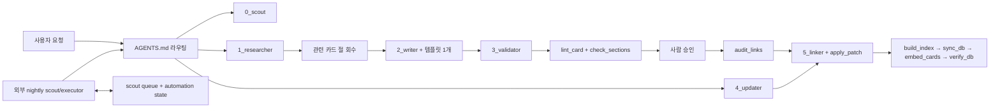

# Game Design Research — RAG 데이터 저장소

게임 설계 리서치 카드를 수집·검증하고 검색용 Postgres/pgvector 거울로 동기화하는 저장소입니다.
마크다운 카드가 원본이며 DB는 재생성 가능한 파생물입니다. 스펙 작성, Unity 구현, QA 판정은 이 저장소의 범위가 아닙니다.

AI 작업 규칙의 단일 원본은 [`AGENTS.md`](AGENTS.md)입니다. 이 문서는 사람이 구조를 빠르게 파악하기 위한 안내서이며, 세부 규칙을 복제하지 않습니다.

## 현재 오케스트레이션



프롬프트는 역할을 나누지만 별도 벤더 SDK 오케스트레이터는 두지 않습니다. Codex·Claude 같은 실행 에이전트가 `AGENTS.md`의 읽기 지도를 따라 필요한 프롬프트와 CLI만 호출합니다.
저장소 밖에서 예약 실행되는 nightly 작업도 같은 `AGENTS.md` 계약과 `research/_scout_queue.md`·`research/_automation_state.md` 상태를 사용합니다.

## 디렉터리

- `research/`: ELEM, GENRE, GAME, SIGNAL, ARCH 카드 원본과 자동 생성 색인
- `prompts/`: 조사·집필·검수·갱신·링크 보강 역할 계약
- `templates/`: 카드 종류별 영문 작성 골격
- `scripts/`: 로컬 검증, 링크 감사, 승인된 섹션 패치 적용
- `tools/`: 색인 생성, 검색, DB 동기화·임베딩·검증
- `card_schema.py`: 카드 필드, 절, ID, 표시자의 단일 스키마
- `reference/`: 새 ARCH 카드가 읽는 영문 활성 근거와 보존용 한국어 원문
- `db/`, `bridge/`: Postgres 스키마와 443/HTTPS 폴백
- `skills/`: 외부 에이전트가 설치·패키징할 수 있는 단일 소스 스킬
- `reports/`: 구조 평가와 의사결정 기록

## 카드 작업 한 사이클

1. `research/_index.md`에서 중복과 사용 중인 ID를 확인합니다. 새 ID는 해당 종류의 다음 미사용 번호로 배정하며 자동 생성 색인을 직접 편집하지 않습니다.
2. `prompts/1_researcher.md`로 근거를 수집합니다.
3. `search_cards.py` 또는 종류별 색인에서 관련 절을 회수하되 본문은 최대 2장만 확인합니다.
4. `prompts/2_writer.md`, 회수한 관련 절, 해당 템플릿 하나로 영문 카드를 작성합니다.
5. `prompts/3_validator.md`의 적대적 검수와 로컬 검사를 통과시킵니다.
6. 사람이 카드 편입을 승인합니다.
7. `scripts/audit_links.py --for <CARD-ID>`로 역방향 간극을 찾고 필요할 때만 `prompts/5_linker.md`를 사용합니다.
8. 카드나 다이제스트가 바뀌면 M단계를 순서대로 실행합니다.

```powershell
$cards = Get-ChildItem research -Recurse -Filter *.md |
  Where-Object { $_.Name -notlike '_*' } |
  ForEach-Object FullName

python scripts/lint_card.py @cards --index research/_index.md
python scripts/check_sections.py
python scripts/audit_links.py

python tools/build_index.py
python tools/sync_db.py
python tools/embed_cards.py
python tools/verify_db.py
```

`verify_db.py`의 `unresolved_refs`가 0이어야 미러링이 완료됩니다. DB 연결 실패는 카드 원본의 실패가 아니므로 카드 결과와 미러링 결과를 분리해 보고합니다.

## 검색

검색 단위는 카드 전체가 아니라 `card_sections`의 절입니다. 벡터 검색과 트라이그램 검색을 결합하며, `section_key`는 표시 언어와 분리된 안정적인 키입니다.

```powershell
python tools/search_cards.py "덱빌딩 로그라이트의 흔한 실패" --kind GAME --show-body
python tools/search_cards.py "타워 디펜스 시장 포화" --section-key market_saturation,gaps
```

검색기·임베딩 모델·청크 방식을 바꾸기 전후에는 같은 골드셋으로 평가합니다.

```powershell
python scripts/eval_retrieval.py
```

## 설치와 안전 경계

- Python 3.11 이상이 필요합니다.
- DB 기능을 쓸 때만 `pip install -r db/requirements.txt`를 실행합니다.
- HTTPS 브리지는 `cd bridge; npm ci`로 의존성을 설치합니다. `node_modules`는 버전 관리하지 않습니다.
- `tools/init_db.py`는 테이블을 DROP하므로 빈 DB 최초 구성에만 사용합니다.
- 살아 있는 DB에 직접 INSERT/UPDATE하지 않습니다. 쓰기는 `tools/sync_db.py`만 담당합니다.
