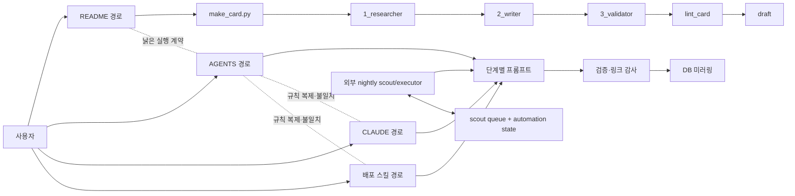
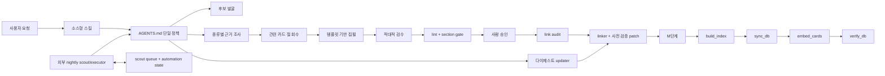

# RAG 오케스트레이션 구조 진단 및 통합 보고서

작성일: 2026-08-12
범위: 리서치 카드 수집·검증·링크 감사·검색용 DB 미러링
결론: 벤더 고정 자동화와 중복 정책을 제거하고, `AGENTS.md`를 단일 정책 원본으로 하는 에이전트 오케스트레이션으로 통합했다.

## 1. 변경 전 구조

변경 전에는 같은 작업에 네 개의 진입점이 있었다. `README.md`는 `scripts/make_card.py`를 주 경로로 안내했지만, 최신 `AGENTS.md`와 배포 스킬은 에이전트가 프롬프트와 CLI를 직접 조정하는 경로를 사용했다. `.claude/CLAUDE.md`와 두 스킬 패키지는 정책을 각각 복제하고 있어 시간이 지나면 서로 달라지는 구조였다.

## 2. 판단 과정

### 2.1 단일 원본 확인

카드 규격은 이미 `card_schema.py`, 원본 데이터는 `research/*.md`, 실행 라우팅은 `AGENTS.md`가 맡는 구조가 가장 명확했다. 따라서 README, 에이전트별 지침, 스킬에 같은 세부 규칙을 반복할 이유가 없다.

### 2.2 자동 생성 CLI 평가

`scripts/make_card.py`는 다음 이유로 제거 대상으로 판단했다.

- Anthropic SDK와 특정 모델 문자열에 고정되어 있었다.
- 자동 생성 파일인 `_index.md`를 사람이 먼저 편집해 ID를 예약하라고 요구했다.
- 링크 감사와 M단계를 완료 경로에 포함하지 않았다.
- 최신 에이전트·스킬 경로와 같은 역할을 중복 수행했다.
- 내부 참조는 낡은 README뿐이었다.

기존 CLI 제거는 동작 계약을 바꾸는 중요 결정이므로 사용자 승인을 받은 뒤 삭제했다.

### 2.3 프롬프트 계약 평가

- `0_scout`은 웹 조사 역할이 아닌데 입력에 없는 리뷰 수를 기준으로 후보를 고르게 했다.
- `1_researcher`는 모든 카드 종류의 조사 프롬프트로 안내되지만 실제 규칙은 GAME 조사에만 맞았다.
- `2_writer`의 예시 카드 두 장은 스타일 앵커와 사실 근거의 경계를 흐리고 불필요한 본문 주입을 만들었다.
- 카드 간 연결을 작성할 근거가 명시적 입력으로 전달되지 않았다.

이에 따라 조사 범위를 카드 종류별로 나누고, 관련 카드의 필요한 절만 회수해 writer에 전달하도록 계약을 바꿨다.

### 2.4 실패 안전성 평가

기존 `apply_patch.py`는 카드나 절을 찾지 못하면 그 항목만 건너뛰고 계속 실행했다. 여러 패치 중 일부만 적용된 상태가 정상 완료처럼 보일 수 있었다. 새 구현은 전체 패치의 대상, action, section, text를 먼저 검증하고 하나라도 틀리면 아무 파일도 쓰지 않는다.

### 2.5 AI 가독성과 저장소 위생

- 바이너리 `.skill`/`.zip` 두 개는 AI가 직접 읽기 어렵고 같은 정책을 중복했다. 하나의 소스형 스킬 디렉터리로 통합했다.
- `bridge/node_modules`는 `package-lock.json`으로 재현 가능하므로 저장소에서 제거하고 무시 목록에 넣었다.
- 과거 의사결정 보고서는 삭제하지 않고, 현재 실행 지침이 아니라는 경고를 추가했다.
- `_scout_queue.md`와 `_automation_state.md`는 저장소 내부 호출자가 없어도 2026-08-11까지 외부 nightly 작업이 갱신한 운영 인터페이스이므로 보존했다.
- 빈 작업 디렉터리는 추적 파일이 아니므로 삭제 대상에 포함하지 않았다.

### 2.6 영어 전용 reference 경로

한국어 원문에는 폐기된 구현 지시가 함께 남아 있다. 원문을 제자리에서 영어로 바꾸면
기존 인용의 의미가 흔들리고, 폐기된 작업 흐름도 계속 노출된다. 따라서 영어 에이전트는
필요한 근거만 추린 영문 활성 가이드를 읽고, 한국어 원문은 사람의 대조용 보존 근거로만 둔다.

## 3. 통합 후 구조

책임 경계는 다음과 같다.

- `AGENTS.md`: 무엇을 언제 읽고 실행할지 결정하는 단일 정책
- `prompts/`: 한 단계의 역할과 입출력 계약
- `card_schema.py`와 `templates/`: 카드 형식의 기계·사람용 원본
- `scripts/`: 로컬 품질 게이트와 승인된 패치 적용
- `tools/`: 검색 및 파생 데이터 재생성
- `research/`: 유일한 지식 원본
- 사람 승인: 카드 편입과 판단이 필요한 링크 수정의 경계

## 4. 제거·수정 내역

### 제거

- `scripts/make_card.py`
- 추적 중이던 `bridge/node_modules/`
- 중복 바이너리 스킬 패키지 2개
- `card_schema.py`의 사용되지 않는 호환 상수 `REQUIRED_SECTIONS`, `SECTIONS`

### 통합·수정

- `AGENTS.md`를 단일 정책 문서로 재작성
- `.claude/CLAUDE.md`를 `AGENTS.md` 포인터로 축소
- `README.md`를 현재 구조 중심으로 축약
- 소스형 `skills/game-research-card-maker/` 추가
- `reference/*_active.md` 영문 활성 근거 추가 및 ARCH 라우팅 전환
- `0_scout`, `1_researcher`, `2_writer`, `3_validator`, `4_updater`, `5_linker`의 입력·실패 계약 정합화
- `scripts/apply_patch.py`를 전체 사전 검증 방식으로 변경
- 오래된 고정 카드 수와 완료된 번역 이관 설명 제거
- 과거 ARCH 보고서에 보존 문서 표시 추가

## 5. 검증 결과

- 소스형 스킬 검증: 통과
- `scripts/test_apply_patch.py`: 통과; 잘못된 두 번째 패치가 있을 때 첫 번째 패치도 기록되지 않음
- Python 구문 검사: 통과
- 카드 형식 검사: 전체 통과
- 절 분할 검사: 카드 165장, 절 829개 통과
- 링크 감사: 확실한 결함 0건
- 링크 감사의 `확인 필요`: 기존 `fm_body_drift` 8건

`fm_body_drift` 8건은 실제 사용 관계인지 비교·배제 문장인지 카드 본문을 읽어야 판단할 수 있다. 이번 작업은 오케스트레이션 정리이며 카드 본문을 임의로 바꾸지 않는 것이 안전하므로 보류했다.

초기 정리 단계에서는 카드 원본을 수정하지 않았으므로 M단계를 실행하지 않았다. 이후 영어 실행 표면 점검에서 `GAME-011` 제목 한 건을 영어로 정정했으므로 M단계를 실행했다. 443/HTTPS 경로에서 cards 165장, sections 829개, digests 6개를 동기화했고, 임베딩과 `unresolved_refs: 0`을 확인했다.

## 6. 언어 실행 표면 정리

- `AGENTS.md`, 템플릿 주석, 프롬프트, 도구의 CLI 도움말·오류·결과 메시지와 핵심 모듈 개요를 영어로 통일했다.
- 생성 인덱스는 영어 라우팅 정보만 제공한다. 추가 전용인 과거 signal 원본의 한국어 출처 목록은 인덱스에 복사하지 않고, 필요한 경우에만 원문을 연다.
- `audit_links.py`의 자동 수정 제안 절 제목을 현재 영문 템플릿(`Success Cases`, `Synergy`)과 일치시켰다. 이전 한국어 절 제목은 `apply_patch.py`의 영문 계약과 맞지 않아 실제 수정 제안을 무효화할 수 있었다.
- 한국어 정규식·과거 섹션명·원문 signal은 호환성과 기록 보존을 위한 데이터이며, 정상 에이전트 경로에는 주입하지 않는다. 내부 구현 주석은 명령 실행 시 컨텍스트에 포함되지 않으므로 일괄 번역 대상으로 확대하지 않았다.

검증 시 템플릿과 생성 인덱스에서 한글 노출은 0건이었다.

## 7. 남은 권고

1. 다음 카드 작업 때 새 경로를 실제로 한 사이클 실행해 프롬프트 입출력의 운영 적합성을 확인한다.
2. `fm_body_drift` 8건은 별도 카드 검수 작업으로 처리한다. 한 번에 최대 2장만 읽는 저장소 규율을 지킨다.
3. 배포물이 필요할 때는 `skills/game-research-card-maker/` 소스를 그 시점에 패키징한다. 생성된 바이너리를 Git 원본으로 다시 두지 않는다.
